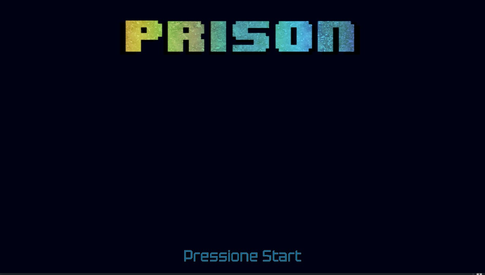
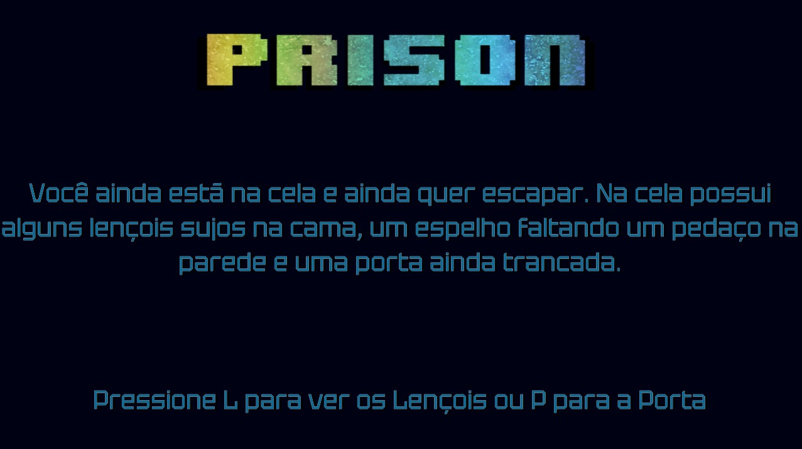

# Prison Break

## Summary
- [Prison Break](#prison-break)
  - [Summary](#summary)
  - [1. Description](#1-description)
  - [2. General Information](#2-general-information)
    - [2.1 History](#21-history)
    - [2.2 Screenshots](#22-screenshots)
  - [3. Gameplay](#3-gameplay)
    - [3.1 Objective](#31-objective)
    - [3.2 Controls](#32-controls)

------------------------------

## 1. Description

***Prison Break*** is a text adventure game. In the game you need to choose your actions and escape from the prison.

## 2. General Information
### 2.1 History

Your life in prison has to end, all the torture and mistreatment can no longer happen. It's time to put the plan on action, it's time to escape.

### 2.2 Screenshots

[TL;DR Go to Gameplay](#3-gameplay)

Menu Inicial

Tela do Jogo

## 3. Gameplay
### 3.1 Objective

The objective of the game is to escape the prison.

### 3.2 Controls

The controls are dictate by the scene you are. The key you have to press are on the text.
